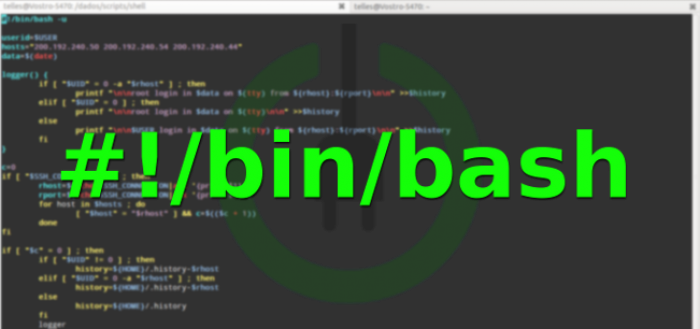

Clonar e Remover Ambiente de Feature
========================

## Adicionar ou remover um ambiente para utilizar novas Features

cloneambiente.sh - Faz o clone do ambiente de base, renomeando para um nome escolhido e, renomeando todos os objetos e alterando as portas dos serviços.

 Finalidade do programa: Criar um ambiente para o desenvolvedor testar novas funcionalidades "features" e rodar em um ambiente que não apalhe o ambientes de develop/homologação.
                         Ex.: Uma nova branch feature-botao.

removerfeature.sh - Remove completamente um ambiente apartir do nome do
                    seu projeto.

 Finalidade do programa: Remover os containers, imagens, volumes, pasta  o ambiente do projeto, ou seja, apagar todo o conteudo que faz parte do projeto da Feature em questão.

Requisitos
------------

Não se aplica.

Dependências
------------

Linux Bash.

Execução
-------------------

Para criar um novo ambiente de Feature:  

    $ cloneambiente "nome do projeto"

Para remover um ambiente de Feature:

    $ removerfeature "nome do ambinte"

Informações do Autor
------------------

- Este projeto foi criado por Willdimark Ragazzi Ventura, DevOps Engineer. (<fininho.cetec@gmail.com>)
- Linkedin [Perfil](https://www.linkedin.com/in/willdymark-ragazzi-ventura-ccna-devnetsecops-membro-anppd%C2%AE-a4422617//).
